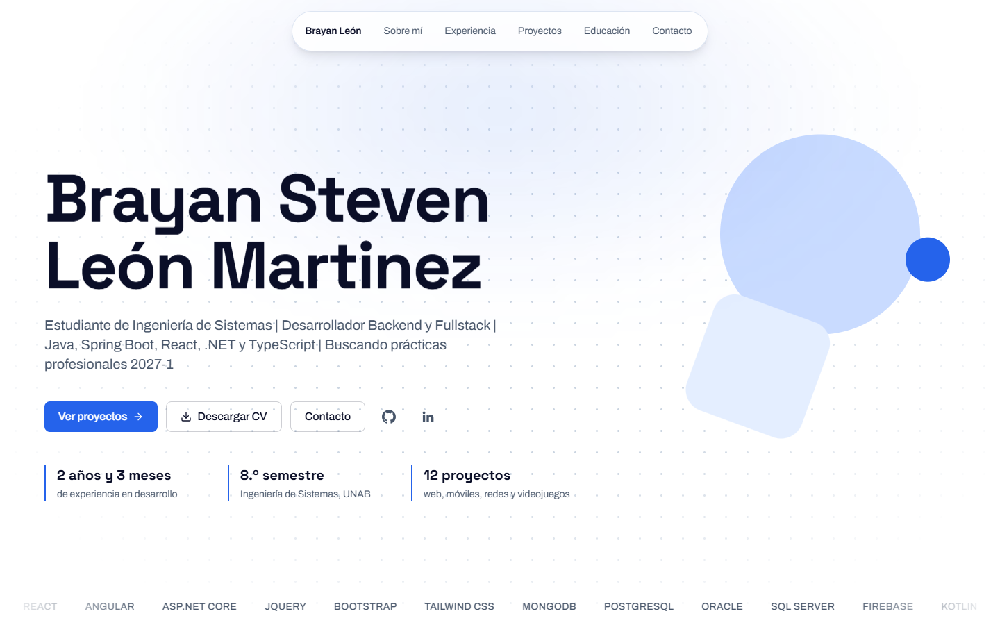
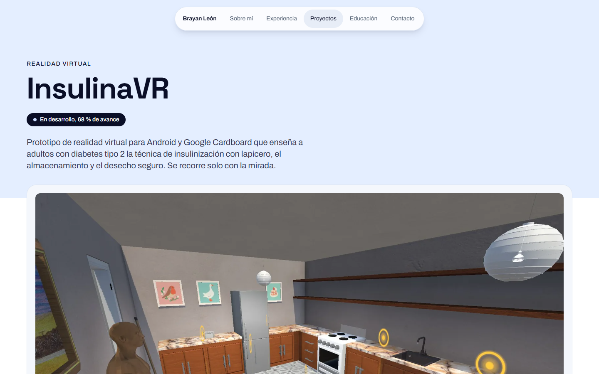
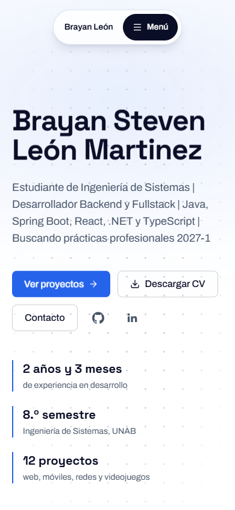

# Portafolio de Brayan Steven León Martinez


Portafolio profesional de un estudiante de Ingeniería de Sistemas (UNAB) que busca prácticas como desarrollador Backend o Fullstack en 2027-1. Reúne experiencia, proyectos con su detalle técnico, formación y certificados, en un sitio claro, rápido y accesible.



| Proyectos | Proyecto de grado | Móvil |
|---|---|---|
|  |  |  |

## Qué incluye

- **Inicio** con presentación, datos clave, descarga del CV y enlaces a GitHub y LinkedIn.
- **Experiencia** en formato de línea de tiempo, con funciones, entorno técnico y referencia de la empresa.
- **Proyectos** con filtros por categoría y tecnología guardados en la URL, y una página de detalle por proyecto con galería de capturas, decisiones técnicas y resultados.
- **Educación** con formación académica y certificados filtrables por área y emisor.
- **Contacto** con botón para copiar el correo y enlaces a las redes.
- Carga inicial animada, transiciones entre páginas, barra de progreso de lectura y menú móvil accesible.

## Tecnologías

| Área | Herramientas |
|---|---|
| Interfaz | React 19, TypeScript, React Router 7 |
| Estilos | Tailwind CSS v4 con tokens propios, Space Grotesk y Archivo |
| Animación | motion y GSAP (componentes de React Bits y estilo Aceternity UI) |
| Iconos | lucide-react y simple-icons |
| Herramientas | Vite 8, oxlint, tsx |
| Métricas | Vercel Web Analytics y Speed Insights |
| Despliegue | Vercel |

## Estructura

```text
src/
├── app/          App, router y rutas con carga diferida
├── components/
│   ├── layout/   Barra flotante, menú móvil, footer, secciones
│   ├── ui/       Loader, Stepper, Timeline, filtros, Reveal, Marquee
│   └── bits/     Componentes de React Bits (instalados con shadcn CLI)
├── features/     Un módulo por área: home, about, experience, projects, education, stack, contact
├── pages/        Una página por ruta; solo componen features
├── data/         Todo el contenido editable (ver más abajo)
├── hooks/        usePageMeta, useActiveSection
├── lib/          Utilidades (fechas, colecciones, intro)
├── styles/       CSS global y tokens de diseño
└── types/        Tipos compartidos
public/           CV, íconos, imagen para compartir e imágenes de proyectos
scripts/          Generador de SEO que se ejecuta después del build
design-system/    Guía de color, tipografía y reglas de diseño
docs/             Capturas usadas en este README
```

## Primeros pasos

Requisitos: Node 22.12 o superior y npm.

```bash
npm install
npm run dev
```

| Comando | Qué hace |
|---|---|
| `npm run dev` | Servidor de desarrollo en `http://localhost:5173` |
| `npm run build` | Comprueba tipos, compila y genera el SEO de cada ruta |
| `npm run preview` | Sirve el build de producción en local |
| `npm run lint` | Revisa el código con oxlint |

## Cómo editar el contenido

Agregar algo nuevo es editar un archivo de datos; no hace falta tocar componentes.

| Quiero cambiar | Archivo |
|---|---|
| Nombre, redes, correo, CV y menú | `src/data/site.ts` |
| Proyectos y sus capturas | `src/data/projects.ts` y `public/projects/<slug>/` |
| Experiencia laboral | `src/data/experience.ts` |
| Estudios | `src/data/education.ts` |
| Certificados | `src/data/certifications.ts` |
| Stack técnico | `src/data/stack.ts` |
| Textos de «Sobre mí» | `src/data/about.ts` |
| Título y descripción de las páginas fijas | `src/data/seo.ts` |

Para sumar un proyecto, agrega un objeto a `projects` con `slug`, `title`, `category`, `description`, `stack` y, si tiene capturas, `image` y `gallery`. Con `featured: true` aparece también en la página de inicio. Las rutas, los filtros, el sitemap y el SEO de su página se generan solos.

## Diseño

Paleta «azul hielo»: blanco, un solo pastel azul para las tarjetas y cobalto solo para las acciones. Las categorías se distinguen con texto, no con color. Los tokens están en `src/styles/index.css` y las reglas completas en [`design-system/portafolio/MASTER.md`](design-system/portafolio/MASTER.md).

Accesibilidad: foco visible, contraste mínimo 4.5:1, objetivos táctiles de 44 px, respeto de `prefers-reduced-motion` y navegación completa con teclado.

## SEO

`npm run build` ejecuta `tsc`, `vite build` y `scripts/generate-seo.mjs`. El script:

- crea un `index.html` por ruta con título, descripción, canonical, Open Graph, Twitter y datos estructurados (JSON-LD) propios, para que LinkedIn, WhatsApp y X muestren la vista previa correcta aunque no ejecuten JavaScript;
- genera `sitemap.xml` y `robots.txt` con la dirección real del sitio.

La dirección sale de la variable `SITE_URL`. Si no existe, usa `VERCEL_PROJECT_PRODUCTION_URL` (que entrega Vercel) y, como último recurso, un valor por defecto en el script. El PDF del CV se sirve con `noindex` para que no aparezca en buscadores.

## Despliegue en Vercel

1. Importa el repositorio en Vercel. Detecta Vite: comando `npm run build`, carpeta de salida `dist`.
2. En **Settings → Deployment Protection**, deja la protección solo para *Preview*. Si producción exige iniciar sesión, Google no puede indexar el sitio.
3. Opcional: define `SITE_URL` en *Production* si usarás un dominio propio.
4. Después del primer despliegue:
   - abre `/sitemap.xml` y `/robots.txt` para comprobar la dirección;
   - da de alta el sitio en Google Search Console y envía el sitemap;
   - prueba la vista previa al compartir un enlace en LinkedIn;
   - pon la dirección en tu perfil de LinkedIn y de GitHub.

## Métricas

El sitio usa [Vercel Web Analytics](https://vercel.com/docs/analytics) y [Speed Insights](https://vercel.com/docs/speed-insights) para saber cuánta gente entra y qué tan rápido carga. Miden visitas, páginas más vistas, país, dispositivo, origen del tráfico y velocidad real, sin cookies y sin datos personales. Cada ruta cuenta como una visita propia. En local los componentes no se montan, así que las pruebas no ensucian las estadísticas.

Para activarlas, después del primer despliegue:

1. En el proyecto de Vercel, entra a la pestaña **Analytics** y pulsa **Enable**.
2. Haz lo mismo en la pestaña **Speed Insights**.
3. Vuelve a desplegar si Vercel lo pide. El script solo se sirve cuando la función está activada.
4. Los primeros datos aparecen a los pocos minutos de recibir visitas. Los planes gratuitos tienen límites mensuales; conviene revisarlos en el panel.

## Rendimiento

Medido con Lighthouse en móvil sobre el build de producción:

| Página | Rendimiento | Accesibilidad | Buenas prácticas | SEO |
|---|---|---|---|---|
| Inicio | 85 | 100 | 100 | 100 |
| Proyectos | 82 | 98 | 100 | 100 |
| Proyecto de grado | 81 | 100 | 100 | 100 |

## Autor

**Brayan Steven León Martinez**, estudiante de Ingeniería de Sistemas en la Universidad Autónoma de Bucaramanga.

- GitHub: [@bleon133](https://github.com/bleon133)
- LinkedIn: [Brayan Steven León Martinez](https://www.linkedin.com/in/brayan-steven-le%C3%B3n-martinez-a7528416b)

## Licencia

Todos los derechos reservados. El contenido, las capturas de proyectos y el CV son personales. El código puede consultarse como referencia, pero no se autoriza a copiar el sitio completo como portafolio propio.
